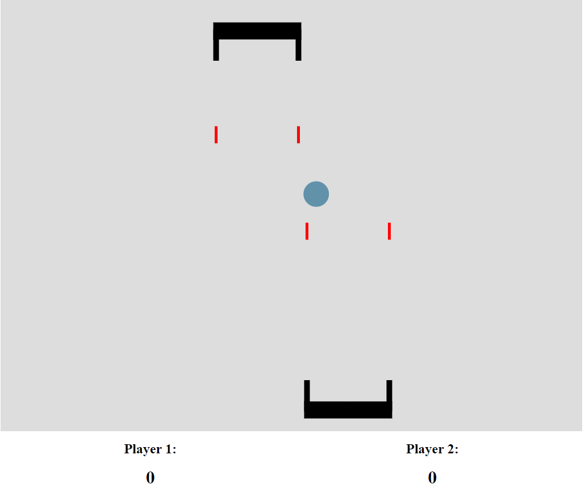

# Pong-Clone
A twist on pong with a touch of strategy.

The game is continuous. Scoring points does not affect the pacing of the game.
There is no built in stopping point. People can play for as long as they want.

### Multiple balls can be in play at once.

### Players can shoot lasers to shock each other and destroy balls.

